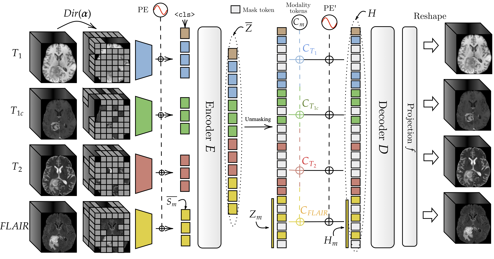

<div align="center">
  
   <h1> Multimodal Masked Autoencoder Pre-training for 3D MRI-based Brain Tumor Analysis with Missing Modalities </h1>
</div>

This is a Python repository for recovering weights or re-training a multimodal masked autoencoder on anatomical brain MRIs. It naturally handles missing modalities and processes any combination of them. The model supports fine-tuning for classification, segmentation, survival analysis and enables 3D MRI reconstruction from available input modalities.

Supporting code for the corresponding [paper](https://arxiv.org/pdf/2505.00568)

# 🌰 In a nutshell
**BM-MAE** is based solely on block transformers for extracting multimodal anatomical MRI features that can later be used to fine-tune model. The considered anatomical modalities are: T1, T1c, FLAIR, T2.

<div align="center">
  
</div>

<br>

# 🚀 Installation
We recommend using conda and installing the required libraries from the CLI as follows:
```
$ conda create -n bmmae python=3.10.10
$ conda activate bmmae
$ pip install requirements.txt
```
and you're good to go!
<br>

# 📥 Download pre-trained weights
The weights of all models are available for download from [Google Drive](https://drive.google.com/drive/folders/10Z0W_9VrPvY-hhVXTeyoskSx4O47NR5q?usp=sharing). 
You can also simply download them from the [HuggingFace Hub](https://huggingface.co/luklebigbosse/BM-MAE)
Once downloaded, place all models in `pretrained_models`.
There are two available models:

1️⃣ `bmmae.pth` – The original base model pretrained on BraTS2021. <br>
2️⃣ `bmmae_tcga.pth` – A specialized model for pre-trained without the TCGA subset. <br>
<br>
<br>

You can also load them directly from HuggingFace with the following code
```python
from bmmae.model import BMMAE, ViTEncoder
model = BMMAE.from_pretrained()
encoder_only = ViTEncoder.from_pretrained()
```
# 📂 The Data
To train the model or replicate the fine-tuning results presented in the paper, you will need to download the [BraTS2021](https://arxiv.org/abs/2107.02314).
<br>
<br>

# ⚡️ Quickstart
The simplest way to use BM-MAE is to extract a relevant representation through the ViT encoder. Suppose, for a patient, you only have two modalities: T1 and T2
```python
import torch
from bmmae.model import ViTEncoder
from bmmae.tokenizers import MRITokenizer

modalities = ['t1', 't2']
tokenizers = {
            modality: MRITokenizer(
                patch_size=(16, 16, 16),
                img_size=(128, 128, 128),
                hidden_size=768,
            )
            for modality in modalities
        }

encoder = ViTEncoder(
            modalities=modalities,
            tokenizers=tokenizers,
            cls_token=True
        )

state_dict = torch.load('pretrained_models/bmmae.pth')
encoder.load_state_dict(state_dict, strict=False)
inputs = {'t1': torch.randn(1, 1, 128, 128, 128), 't2': torch.randn(1, 1, 128, 128, 128)}
outputs = encoder(inputs) # shape of [1, 1025, 768]
```
<br>

# 🧠 Reconstructing missing modalities
BM-MAE allows simple reconstruction of any combination of modalities.
Concrete examples are given in the file: `reconstructions.ipynb`.
<br>
<br>

# 🔄 Pretraining BM-MAE
Although weights are supplied, it is still possible to train the model from scratch using multimodal MRI data:
```
$ python pretrain_bmmae.py --data_dir PATH/TO/DATASET
```

# 🎯 Fine-tuning
Fine-tuning BM-MAE for segmentation, subtyping or survival analysis is straightforward. Follow the steps below based on your task: <br> <br>
To adapt a UNETR model using the pre-trained ViT for segmentation on the T1c and FLAIR modalities for instance
```
$ python finetune_seg.py --modalities t1ce flair
```
To fine-tune a ViT for subtyping classification (e.g. LGG vs GBM) using only the T1 modality for instance, use the following CLI.
<br>

```
$ python finetune_cls.py --task project_id --modalities t1
```
Note that this setup uses the dataset located at `data/data.csv`.
The `--task` argument corresponds to any column from this file.
Currently available tasks include project_id (subtyping), IDH, MGMT, and TERT labels.
<br>
<br>
Finally, for survival analysis, simply use the same nomenclature as before (listed after --modalities) and run, for example, on all modalities:
```
$ python finetune_cls.py --task project_id --modalities t1 t1ce t2 flair
```
# 📒 Notebooks
Two notebooks are included in this repository in addition to `reconstructions.ipynb`.
<br>
- `eval_seg.ipynb` allows you to evaluate fine-tuned segmentation models and perform Wilcoxon tests.
- `clustering.ipynb` groups TCGA patients by predicted scores across the 4 MRI modalities and plots Kaplan-Meier curves to assess the stratification power of the models.
  
# ⭐ Contribute & Support

💡 Found a bug? Want to add features? Feel free to submit a pull request! <br>
📩 Questions? Open an issue.
<br>
<br>

# 📝 Citation
```
@misc{robinet2025multimodalmaskedautoencoderpretraining,
      title={Multimodal Masked Autoencoder Pre-training for 3D MRI-Based Brain Tumor Analysis with Missing Modalities}, 
      author={Lucas Robinet and Ahmad Berjaoui and Elizabeth Cohen-Jonathan Moyal},
      year={2025},
      archivePrefix={arXiv},
      primaryClass={cs.CV},
}
```
